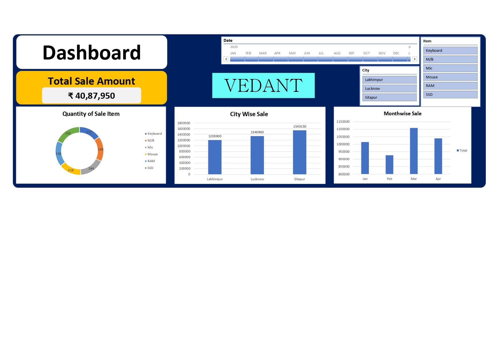
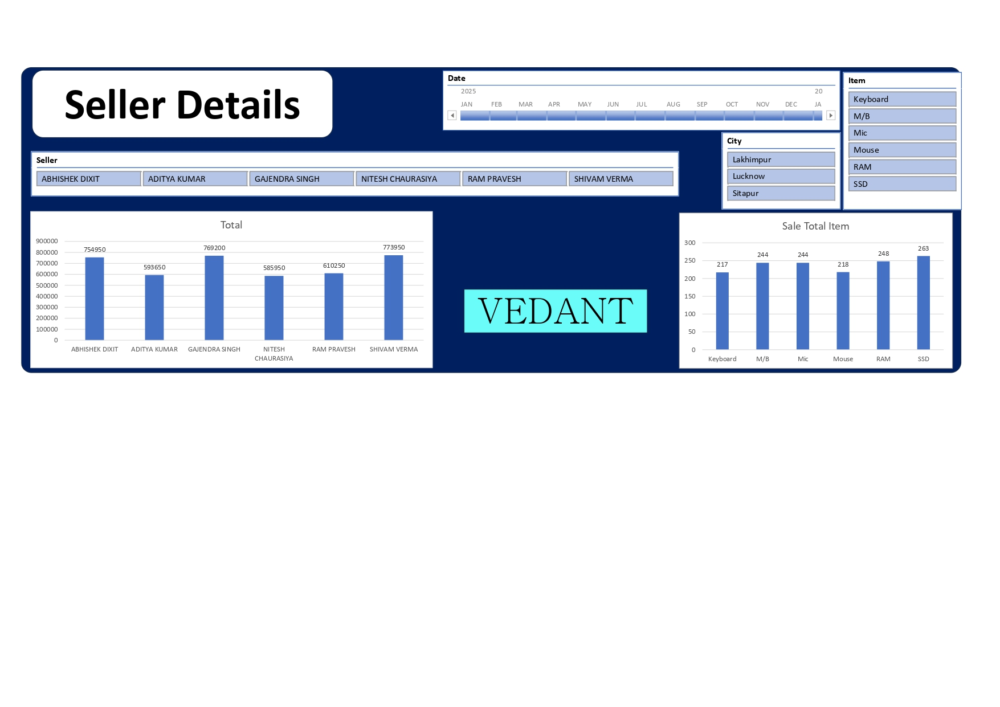

📊 Excel Sales Dashboard Project

This project is an **interactive Excel Sales Dashboard** created to analyze and visualize sales data effectively.  
It provides clear insights into **total sales, item-wise quantity, city-wise sales, month-wise trends, and seller performance** using Excel tools.

🔹 Project Overview

The dashboard helps in:
- Tracking **Total Sales Amount**
- Analyzing **City-wise Sales**
- Monitoring **Month-wise Sales Trends**
- Comparing **Seller Performance**
- Understanding **Item-wise Sales Quantity**

The project is fully dynamic using **Excel slicers and charts**.

🛠 Tools & Features Used

- Microsoft Excel
- Pivot Tables
- Pivot Charts
- Slicers (Date, City, Item, Seller)
- Data Visualization (Bar Chart, Donut Chart)
- Dashboard Design & Formatting

📈 Dashboard View

🔹 Main Sales Dashboard

This dashboard shows:
- Total Sale Amount
- Quantity of Sale Items
- City-wise Sales
- Month-wise Sales
- Filters for Date, City, and Item

🔹 Seller Details Dashboard

This dashboard shows:
- Seller-wise Total Sales
- Item-wise Sale Quantity
- Filters for Seller, City, Date, and Item

📂 Project Files

- `Seller_Details.xlsx` → Main Excel dashboard file  
- `dashboard.png` → Main dashboard screenshot  
- `seller_details.png` → Seller details dashboard screenshot  

🎯 Key Learnings

- Building professional Excel dashboards
- Using slicers for interactivity
- Data summarization using pivot tables
- Effective data visualization techniques

## 🚀 How to Use

1. Download the Excel file  
2. Open in Microsoft Excel  
3. Use slicers to filter data by:
   - Date
   - City
   - Item
   - Seller  

## 👩‍💻 Created By

Vedant Bhujangrao Dharmale 

Excel | Data Analysis | Dashboard Design

